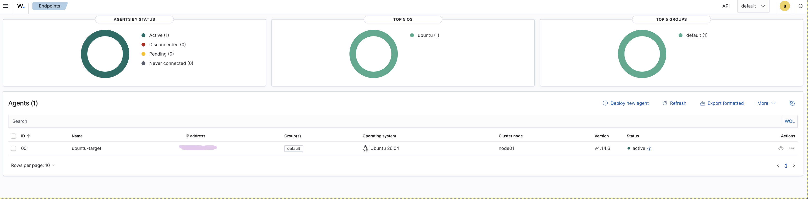

### Target VM Setup
1. Install Ubuntu Server 26.06 LTS with OpenSSH.

# Installing Wazuh on the endpoint 

As per the (User Documentation)[https://documentation.wazuh.com/current/installation-guide/wazuh-agent/wazuh-agent-package-linux.html]

## Adding the Wazuh repository
1. `sudo apt install gnupg apt-transport-https`
2. `curl -s https://packages.wazuh.com/key/GPG-KEY-WAZUH | sudo gpg --no-default-keyring --keyring gnupg-ring:/usr/share/keyrings/wazuh.gpg --import && chmod 644 /usr/share/keyrings/wazuh.gpg`
3. `sudo apt-get update`

(at some point I had to do sudo chmod 644 for the keyfile)

## Deploying the Wazuh agent
1. `sudo WAZUH_MANAGER="[SIEM VM IP from 01-wazuh.md]" apt-get install wazuh-agent`
3. `sudo systemctl daemon-reload`
4. `sudo systemctl enable wazuh-agent`
5. `sudo systemctl start wazuh-agent`

